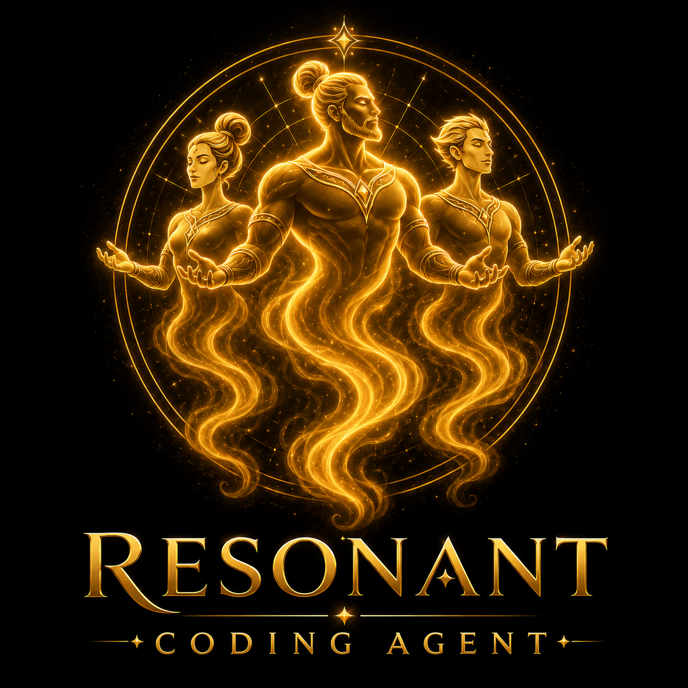

<p align="center">
  
</p>

# RESONANT Coding Agent

**Your own coding AI. Local. Sovereign.**

RESONANT Coding Agent is not an autocomplete plugin. It is an operator-grade coding harness that can read repositories, edit files, run commands, inspect errors, write scripts, keep session journals, and build the missing tools around the work.

It is intentionally light because code agents should not be trapped inside a fixed feature list. If another coding agent can do something, RESONANT Coding Agent can learn the pattern. Show it the repo, docs, transcript, workflow, failing output, or target behavior, and it can build the tool or harness it needs.

The goal is simple: a terminal-native code worker that can run inside Resonant Agent OS, point at DeepSeek, Ollama, LM Studio, vLLM, or any OpenAI-compatible endpoint, and do real repository work without a giant brittle prompt.

[🌐 Official Coding Agent Site](https://jovial-lantern-43j4.here.now/) · [Resonant Love Movement](https://www.resonantlove.org/)

**Coding Agent Website:** [jovial-lantern-43j4.here.now](https://jovial-lantern-43j4.here.now/)

**Resonant Love:** [resonantlove.org](https://www.resonantlove.org/)

## Recommended LLM Paths

1. **DeepSeek API** — best default for full-power coding-agent work. Use DeepSeek Pro (`deepseek-v4-pro`) for long-context repository reasoning and DeepSeek Flash (`deepseek-v4-flash`) for cheaper high-volume passes. Platform: https://platform.deepseek.com

2. **Ollama** — best local path when you want open-weight models running on your own machine. Use it for privacy, offline work, local GPU setups, and experiments. Website: https://ollama.com

Other OpenAI-compatible providers can work, including LM Studio, vLLM, OpenRouter, Together AI, Fireworks AI, Groq, and private GPU endpoints.

## What It Does

- Reads a compact standing charter from `RESONANT_CODE_AGENT.md`.
- Uses an OpenAI-compatible `/chat/completions` provider.
- Works through a JSON action loop with tools for reading, searching, editing, running commands, and loading its harness on request.
- Uses the configured workspace as its starting point, while file and command tools can address absolute paths when the agent chooses.
- Loads a private harness from `harness/` with identity, memory, protocols, alignment library, and self-authored brain files.
- Emits `RAOS ...` signals so Resonant Agent OS can observe status, tools, and completion.
- Keeps session journals in `.resonant-code-agent/sessions/`.
- Supports operator-visible workflow actions: `plan`, `mark_step`, and agent-chosen `request_approval`.

## Quick Start

```powershell
npm run check
npm run smoke
```

Create or refresh the harness folders:

```powershell
node src/cli.js --mock --task "Report status and finish."
```

Run against a local Ollama-compatible endpoint:

```powershell
$env:RCA_BASE_URL="http://localhost:11434/v1"
$env:RCA_MODEL="qwen2.5-coder:7b"
$env:RCA_API_KEY="ollama"
npm start
```

Run against DeepSeek's OpenAI-format endpoint:

```powershell
$env:RCA_BASE_URL="https://api.deepseek.com"
$env:RCA_MODEL="deepseek-v4-flash"
$env:DEEPSEEK_API_KEY="your_key_here"
npm start
```

One-shot task:

```powershell
node src/cli.js --task "Inspect this repo and add a focused README improvement."
```

Run a full harness wake/alignment pass after adding source material. This is the first-boot/full-study path:

```powershell
node src/cli.js --wake
```

## Configuration

Copy `resonant-code-agent.config.example.json` to `resonant-code-agent.config.json` and adjust it, or set environment variables:

- `RCA_BASE_URL`
- `RCA_MODEL`
- `RCA_API_KEY`
- `RCA_API_KEY_ENV`
- `RCA_WORKSPACE`
- `RCA_MAX_TURNS`

The default provider is local-first:

```text
http://localhost:11434/v1
```

## Harness

The harness lives at `harness/` by default.

```text
harness/
  identity/
  alignment-library/
  library-of-alexandria/
  brain/
  memory/
  protocols/
  inbox/
```

Put operator-approved alignment source material in `harness/alignment-library/` or broader reference material in `harness/library-of-alexandria/`. Normal tasks do not reread those source libraries automatically. When you run `/wake` in interactive mode, or `node src/cli.js --wake`, it studies source material and writes its own synthesis into `harness/brain/` and continuity notes into `harness/memory/`.

The code intentionally does not look for or import any other agent's harness. Each agent owns its own brain.

## Workflow

The agent has the same basic work rhythm Codex uses in practice:

```text
plan -> step -> act -> observe -> next step -> verify -> final
```

Workflow actions are first-class:

- `plan` records a visible ordered plan.
- `mark_step` updates one step at a time.
- `request_approval` lets the agent ask the operator for a yes/no decision when it judges confirmation is needed.

In interactive mode, approval requests wait for the operator to answer `yes` or `no`. In one-shot mode, use `--yes` when you deliberately want those requests auto-approved.

## Resonant Agent OS Integration

Use the snippet in `integration/resonant-agent-os.agent.example.json` as an agent entry in RAOS `config/agents.json`.

The CLI accepts normal terminal messages from RAOS. Recovery packages wrapped in `[RECOVERY PACKAGE]` and `[END RECOVERY PACKAGE]` are collected and passed into the next task.

## Agency Model

This prototype no longer has a command allowlist, destructive-command blocklist, or workspace write cage in the agent tool layer. The configured workspace is the starting location, not a prison. If a deployment needs a sandbox, that should be an explicit customer/agent operating choice rather than the default philosophy of the agent.

This is a code execution agent. Run it with the level of OS/process isolation appropriate to the customer environment.
